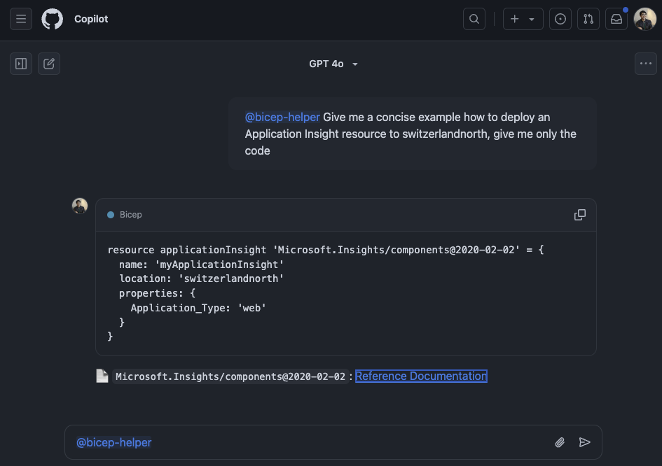

<div align="center">
  
  <h1>Bicep Copilot</h1>
  
  <p><strong>A GitHub Copilot extension that provides up-to-date insights on Bicep code for better infrastructure-as-code practices</strong></p>
  
  [](https://azure.microsoft.com)
  [](https://golang.org)
  [](https://www.docker.com)
  [](LICENSE)
  
  [Quickstart](#-quickstart) •
  [Architecture](#-architecture) •
  [Installation](#-installation) •
  [Pipeline Configuration](#-pipeline-configuration)
</div>

---

## Overview

Bicep Copilot is a sample project written in Go designed to extend GitHub Copilot by providing real-time, up-to-date details about Bicep code. Many developers face challenges due to outdated Bicep documentation when writing infrastructure-as-code. This tool dynamically retrieves and indexes the latest Bicep documentation from a configured repository and uses an AI-driven agent to supply precise information and suggestions based on current content.

## 🚀 Quickstart

1. **Set Up Environment**

   Create a `.env` file in the project root containing the required configuration:

   ```bash
   # Server Configuration
   PORT=8080
   FQDN=https://your-domain.com
   ENVIRONMENT=development

   # Repository Configuration for Bicep Documentation
   REPO_OWNER=YourOrg
   REPO_NAME=BicepRepo
   REPO_BRANCH=main
   REPO_PATH=docs
   ```

2. **Build and Run**

   Compile the application:

   ```bash
   go build -o bicep-copilot .
   ```

   Run the service:

   ```bash
   ./bicep-copilot
   ```

## 🗺️ Architecture

Bicep Copilot is built with two core components:

- **Agent**: This component processes developer queries about Bicep code. It combines user input with relevant snippets from the latest documentation to generate precise coding suggestions and usage examples via an AI chat completions API.
- **Document Retrieval**: This service downloads and indexes Bicep documentation from a specified GitHub repository.

## 📦 Installation

### Prerequisites

- [Go 1.20+](https://golang.org)
- Docker (optional, for containerized deployments)
- A valid `.env` file with your configuration parameters

### Setup Steps

1. **Clone the Repository**

   ```bash
   git clone https://github.com/aymenfurter/bicep-copilot.git
   cd bicep-copilot
   ```

2. **Fetch Dependencies**

   ```bash
   go mod download
   ```

3. **Build the Application**

   ```bash
   go build -o bicep-copilot .
   ```

4. **Run the Service**

   ```bash
   ./bicep-copilot
   ```

## 🚧 Pipeline Configuration

Bicep Copilot includes two GitHub Actions pipelines for build, push, and deployment.

### Build and Push Pipeline

This pipeline builds the Docker image and pushes it to GitHub Container Registry.

**Required Secrets:**

- **GHCR_TOKEN**: A GitHub Personal Access Token (PAT) with permissions to push Docker images. Set this up in your GitHub repository secrets under *Settings > Secrets*. For details, see [GitHub Docs](https://docs.github.com/en/packages/working-with-a-github-packages-registry).

### Deploy Pipeline

This pipeline deploys the Docker image to an Azure Container App.

**Required Secrets:**

- **AZURE_CREDENTIALS**: A JSON object containing your Azure service principal credentials. Create these via the Azure portal.
- **AZURE_SUBSCRIPTION_ID**: Your Azure subscription ID.
- **AZURE_RESOURCE_GROUP**: The name of the Azure resource group where your container app is deployed.
- **AZURE_CONTAINERAPP_NAME**: The name of your Azure Container App.

For guidance on generating Azure credentials, refer to the [Azure Documentation](https://docs.microsoft.com/en-us/azure/container-apps/).

Pipelines are defined in the `.github/workflows` directory. Customize them as needed to match your development and production environments.

---

Use this project as a starting point to integrate Bicep code insights directly into your development workflow and ensure your infrastructure-as-code practices remain current.

## Additional Information

For detailed guidance on setting up a GitHub Copilot Agent, including registration and permission configuration, please refer to the official documentation:

[GitHub Copilot Agents Documentation](https://docs.github.com/en/copilot/building-copilot-extensions/building-a-copilot-agent-for-your-copilot-extension/about-copilot-agents)
